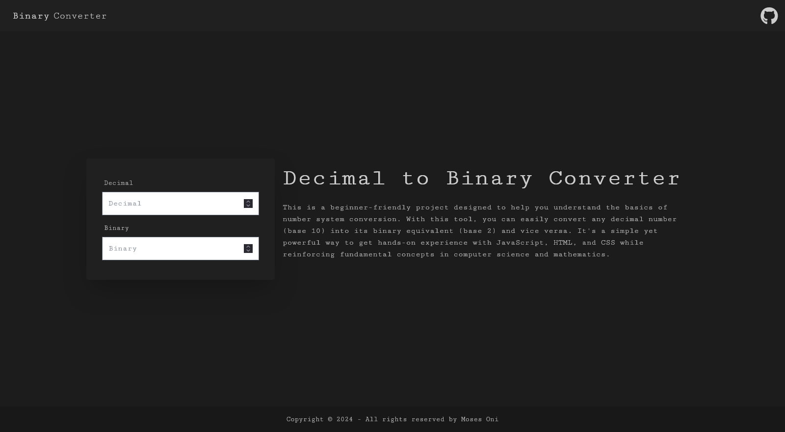

# Decimal to Binary Converter



## Project Overview

This project is a beginner-friendly tool designed to help users convert decimal numbers (base 10) into binary numbers (base 2) and vice versa. Built using HTML, Tailwind CSS, DaisyUI, Font Awesome, and Google Fonts, this project serves as an educational resource for understanding basic number system conversions and practicing front-end web development.

## Key Features

- **Responsive Design:** The layout is fully responsive, ensuring that the converter works well on desktops, tablets, and mobile devices.
- **SEO-Friendly:** Includes essential SEO meta tags to enhance search engine visibility.
- **Modern Typography:** The site utilizes the Roboto font from Google Fonts, providing a clean and modern look.
- **Icon Integration:** Font Awesome icons are used to enhance the visual presentation, particularly in warning and error messages.
- **Tailwind CSS & DaisyUI:** The project is styled using Tailwind CSS with DaisyUI components, facilitating rapid development and a consistent design language.

## Sections

### 1. Converter Interface
The main interface consists of two input fields:
- **Decimal Input:** Allows the user to enter a decimal number that will be automatically converted to binary.
- **Binary Input:** Allows the user to input a binary number, which will be automatically converted to its decimal equivalent.

### 2. Error Handling
If the user enters an invalid binary number (a number containing digits other than 0 and 1), an error message with an informative icon is displayed.

### 3. Footer
The footer contains a dynamically generated copyright notice that automatically updates with the current year.

## Technologies Used

- **HTML5:** Provides the structure and layout of the project.
- **Tailwind CSS:** Utilized for styling the project, allowing for quick and responsive design.
- **DaisyUI:** Adds predefined UI components to the project, enhancing the look and feel without extensive custom CSS.
- **Font Awesome:** Icons are integrated to enhance user experience, especially in error messaging.
- **Google Fonts:** The Roboto font is used to maintain a clean and professional appearance.
- **JavaScript:** Used to handle the conversion logic and dynamic content updates.

## How to Use

1. **Clone the Repository:**
   ```bash
   git clone https://github.com/codewithmoses/Binary-Converter-Beginner-Project.git
